# 🎯 Toolate — Complete Project Overview for Placement Interviews

> **What is Toolate?** A production-grade, full-stack property listing platform (houses, flats, PGs, hotels, roommates, shops) built **entirely on free-tier cloud services** with zero credit-card dependencies. Deployed live on Vercel.
>
> **Live Demo**: [https://toolate-rahul11fs-projects.vercel.app](https://toolate-rahul11fs-projects.vercel.app)

---

## Table of Contents

1. [Project Elevator Pitch](#1-project-elevator-pitch)
2. [Technology Stack — Why Each Choice](#2-technology-stack--why-each-choice)
3. [Architecture Overview](#3-architecture-overview)
4. [Next.js App Router — Deep Dive](#4-nextjs-app-router--deep-dive)
5. [Database Design (Prisma + PostgreSQL)](#5-database-design-prisma--postgresql)
6. [Authentication System (NextAuth.js)](#6-authentication-system-nextauthjs)
7. [OTP Verification Workflow](#7-otp-verification-workflow)
8. [Password Reset with Cryptographic Tokens](#8-password-reset-with-cryptographic-tokens)
9. [API Design — REST Routes & HTTP Methods](#9-api-design--rest-routes--http-methods)
10. [Complete CRUD Lifecycle — Listings](#10-complete-crud-lifecycle--listings)
11. [Input Validation with Zod](#11-input-validation-with-zod)
12. [Security Measures — Defense in Depth](#12-security-measures--defense-in-depth)
13. [Rate Limiting (Upstash Redis)](#13-rate-limiting-upstash-redis)
14. [Caching Strategy (Redis + ISR)](#14-caching-strategy-redis--isr)
15. [File Upload — Dual Storage Engine](#15-file-upload--dual-storage-engine)
16. [AI-Powered Fraud Detection (Claude API)](#16-ai-powered-fraud-detection-claude-api)
17. [Roommate Matching Algorithm](#17-roommate-matching-algorithm)
18. [Geospatial Search — Haversine Formula](#18-geospatial-search--haversine-formula)
19. [Commute-Based Search — OSRM Routing](#19-commute-based-search--osrm-routing)
20. [Transit Proximity (Overpass API)](#20-transit-proximity-overpass-api)
21. [Maps & Geolocation (Leaflet + Nominatim)](#21-maps--geolocation-leaflet--nominatim)
22. [Email System (Resend + Nodemailer)](#22-email-system-resend--nodemailer)
23. [Progressive Web App (PWA)](#23-progressive-web-app-pwa)
24. [SEO Implementation](#24-seo-implementation)
25. [Admin Panel & Role-Based Access Control](#25-admin-panel--role-based-access-control)
26. [Identity Verification System](#26-identity-verification-system)
27. [Hotel Cost-Sharing Feature](#27-hotel-cost-sharing-feature)
28. [Notification System & Polling](#28-notification-system--polling)
29. [Listing Comparison Feature](#29-listing-comparison-feature)
30. [Analytics & View Tracking](#30-analytics--view-tracking)
31. [Cron Jobs & Auto-Expiry](#31-cron-jobs--auto-expiry)
32. [Middleware & Route Protection](#32-middleware--route-protection)
33. [Frontend Patterns & Component Architecture](#33-frontend-patterns--component-architecture)
34. [React Hooks Deep Dive — Used in Toolate](#34-react-hooks-deep-dive--used-in-toolate)
35. [Error Handling & Graceful Degradation](#35-error-handling--graceful-degradation)
36. [TypeScript Concepts Used](#36-typescript-concepts-used)
37. [URL State Management & Shareable Links](#37-url-state-management--shareable-links)
38. [Data Aggregation & Analytics (Prisma groupBy)](#38-data-aggregation--analytics-prisma-groupby)
39. [Debouncing API Calls (Search Autocomplete)](#39-debouncing-api-calls-search-autocomplete)
40. [Deployment on Vercel](#40-deployment-on-vercel)
41. [Design Patterns Used](#41-design-patterns-used)
42. [HTTP Status Codes Used in Toolate](#42-http-status-codes-used-in-toolate)
43. [Database Concepts (Interview Essentials)](#43-database-concepts-interview-essentials)
44. [System Design Interview Q&A](#44-system-design-interview-qa)
45. [Real-World Interview Q&A — 50+ Questions](#45-real-world-interview-qa--50-questions)

---

## 1. Project Elevator Pitch

> **Interviewer**: "Tell me about your project in 60 seconds."

**Answer:**

"Toolate is a **production-grade property listing directory** where landlords can post houses, flats, PGs, hostels, hotels, and commercial spaces, and tenants can browse, filter, compare, and directly contact them — completely eliminating brokerage fees.

The platform is unique because it's built entirely on **free-tier cloud services** — Supabase for the database and storage, Upstash Redis for rate limiting and caching, Resend for transactional emails, and Cloudinary for image CDN — proving that a production-quality SaaS can be shipped with zero infrastructure cost.

**Key differentiators** include:
- **AI-powered fraud detection** using Claude to flag scam listings
- **Dual-storage engine** (Cloudinary → Supabase fallback) for images
- **Hotel cost-sharing** where verified travelers can split hotel stays 50/50
- **Roommate compatibility matching** using a weighted scoring algorithm
- **Identity verification** with document upload and trusted badges
- **Geospatial search** with commute-time filtering using OSRM routing
- **Progressive Web App** installable like a native app with offline caching

It's deployed on Vercel, uses Next.js App Router with React 19, TypeScript, Prisma ORM, and Tailwind CSS v4."

---

## 2. Technology Stack — Why Each Choice

| Layer | Technology | Why This Choice | Real-World Analogy |
|-------|-----------|-----------------|-------------------|
| **Framework** | Next.js (App Router) | Server-side rendering + API routes in one project. No need for separate backend. | Like a **Swiss Army knife** — one tool does frontend, backend, and routing |
| **Language** | TypeScript | Catches bugs at compile time, not at runtime. Autocomplete makes development faster. | Like having a **spell-checker** while writing an essay — errors caught before submission |
| **UI Library** | React 19 | Component-based architecture, Server Components for performance | Like **LEGO blocks** — reusable UI pieces snapped together |
| **Styling** | Tailwind CSS v4 | Utility-first CSS, no separate stylesheet management, custom theme tokens | Like a **pre-stocked paint palette** — all colors ready, just pick and apply |
| **Database** | PostgreSQL (Supabase) | ACID-compliant, relational, handles complex queries. Free 500MB tier. | Like an **organized filing cabinet** with labeled folders and cross-references |
| **ORM** | Prisma | Type-safe queries, auto-generated client, schema-as-code migrations | Like having a **translator** between your code and the database — no raw SQL needed |
| **Auth** | NextAuth.js v4 | Handles OAuth + Credentials, JWT sessions, adapters for Prisma | Like a **building security guard** — checks your ID before letting you in |
| **Object Storage** | Cloudinary + Supabase Storage | Cloudinary for CDN-optimized images; Supabase as fallback | Like having **two parking garages** — if the first is full, use the second |
| **Cache/Rate Limit** | Upstash Redis | Serverless Redis, HTTP-based, no persistent connections needed | Like a **bouncer at a club** — tracks how many times you've entered, blocks if too many |
| **Email** | Resend API + Nodemailer | Resend for free transactional emails, Nodemailer as SMTP fallback | Like having **two postal services** — if FedEx fails, use Royal Mail |
| **AI** | Anthropic Claude API | Fraud detection, description generation, rent estimation | Like hiring a **fraud investigator** to review each listing before approval |
| **Maps** | Leaflet + OpenStreetMap | Open-source, no API key needed, free forever | Like **Google Maps but free** — same functionality, zero cost |
| **Routing** | OSRM (Open Source Routing Machine) | Commute-time calculations between listing and workplace | Like a **GPS navigator** that calculates drive time between two points |
| **PWA** | @ducanh2912/next-pwa | Service worker caching, offline support, installable app | Like turning your **website into a mobile app** without the App Store |
| **Deployment** | Vercel | Zero-config, Git-push deploys, serverless functions, free tier | Like **automated pizza delivery** — push code, it's live in 30 seconds |
| **Validation** | Zod | Schema-based runtime validation with TypeScript inference | Like a **customs officer at an airport** — inspects every field |

---

## 3. Architecture Overview

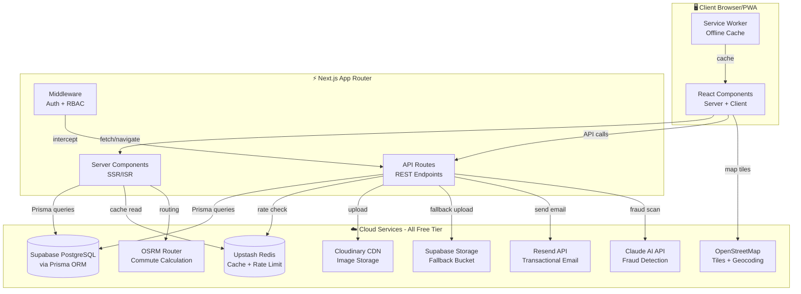

### Three-Tier Architecture Explained

> **Interviewer**: "Explain the architecture of your project."

**Like a restaurant:**
1. **Frontend (Waiter)** — React Components take the customer's order (user interactions) and present the food (UI)
2. **Backend (Kitchen)** — Next.js API Routes + Server Components prepare the data (business logic, database queries)
3. **Database/Services (Pantry)** — PostgreSQL stores ingredients (data), Redis keeps frequently used items on the counter (cache), Cloudinary is the walk-in fridge (images)

**Why monorepo (fullstack in one codebase)?**
- **Type sharing** — the same TypeScript types are used in frontend and backend
- **No CORS issues** — API routes live at the same origin as the frontend
- **Simplified deployment** — one `git push` deploys everything
- **Faster development** — no need to run separate servers

---

## 4. Next.js App Router — Deep Dive

### What is the App Router?

> **Interviewer**: "Explain the difference between Pages Router and App Router."

The App Router (introduced in Next.js 13) uses **file-system-based routing** inside the `src/app/` directory. Every folder becomes a URL segment, and special files (`page.tsx`, `layout.tsx`, `loading.tsx`, `route.ts`) define behavior.

**Key difference from Pages Router:**

| Feature | Pages Router (`/pages`) | App Router (`/app`) |
|---------|------------------------|---------------------|
| Default component | Client Component | **Server Component** |
| Data fetching | `getServerSideProps`, `getStaticProps` | Direct `async/await` in component |
| Layouts | Manual wrapper components | Built-in `layout.tsx` files |
| Loading states | Manual | `loading.tsx` auto-Suspense |
| Streaming | ❌ | ✅ Progressive rendering |
| API Routes | `/pages/api/*.ts` | `/app/api/**/route.ts` |

### Toolate's Complete Route Structure

```
src/app/
├── page.tsx                    → Homepage (/)
├── layout.tsx                  → Root layout (wraps ALL pages)
├── loading.tsx                 → Global loading skeleton
├── globals.css                 → Tailwind theme + custom CSS
├── robots.ts                   → SEO: robots.txt generation
├── sitemap.ts                  → SEO: dynamic sitemap.xml
│
├── listings/
│   ├── page.tsx                → /listings (browse all — 984 lines, Server Component)
│   ├── ListingFilters.tsx      → Client-side filter component
│   ├── [id]/                   → /listings/:id (dynamic route)
│   ├── create/                 → /listings/create (new listing form)
│   └── edit/                   → /listings/edit/:id
│
├── dashboard/
│   ├── page.tsx                → /dashboard (user's listings)
│   ├── DashboardTabs.tsx       → Tabbed UI (listings, payments, settings)
│   └── bulk-import/            → CSV bulk upload
│
├── admin/
│   ├── page.tsx                → /admin (admin dashboard)
│   ├── listings/               → /admin/listings (moderation)
│   ├── settings/               → /admin/settings (CMS)
│   └── feedback/               → /admin/feedback (user messages)
│
├── api/
│   ├── auth/[...nextauth]/     → NextAuth catch-all handler
│   ├── auth/signup/            → Email+OTP signup
│   ├── auth/send-otp/          → OTP generation + delivery
│   ├── auth/forgot-password/   → Password reset token generation
│   ├── auth/reset-password/    → Token verification + password update
│   ├── listings/               → GET (browse) + POST (create)
│   ├── listings/[id]/          → GET/PUT/DELETE single listing
│   ├── listings/[id]/reviews/  → Review CRUD
│   ├── listings/[id]/qa/       → Q&A thread
│   ├── listings/[id]/events/   → View/click analytics
│   ├── listings/[id]/viewings/ → Viewing slot booking
│   ├── listings/[id]/payments/ → Rent payment tracking
│   ├── listings/[id]/split/    → Hotel cost splitting
│   ├── upload/                 → Image upload (Cloudinary→Supabase)
│   ├── admin/                  → Admin-only moderation APIs
│   ├── user/verify-id/         → Identity document verification
│   ├── cron/expire-listings/   → Automated listing cleanup
│   ├── cron/festival-alert/    → Seasonal notifications
│   ├── geocode/search/         → Forward geocoding proxy
│   ├── geocode/reverse/        → Reverse geocoding proxy
│   ├── commute/                → OSRM commute estimation
│   ├── ai/                     → Claude AI endpoints
│   └── notifications/          → User notification CRUD
│
├── login/                      → /login
├── signup/                     → /signup
├── forgot-password/            → /forgot-password
├── reset-password/             → /reset-password
├── about/                      → /about
├── contact/                    → /contact
├── privacy/                    → /privacy
├── terms/                      → /terms
├── tools/
│   ├── rental-agreement/       → PDF rental agreement generator
│   ├── rent-calculator/        → Rent split calculator
│   └── rent-estimator/         → AI rent estimation widget
├── roommate-quiz/              → Lifestyle compatibility quiz
├── areas/                      → Area reviews by locality
├── compare/                    → Side-by-side listing comparison
└── insights/                   → Listing analytics dashboard
```

### Server Components vs Client Components

> **Interviewer**: "What's the difference between Server and Client Components?"

| Aspect | Server Component (default) | Client Component (`'use client'`) |
|--------|---------------------------|----------------------------------|
| **Runs where** | Server only | Server (SSR) + Browser (hydration) |
| **JavaScript shipped** | ❌ Zero JS sent to browser | ✅ JS bundle sent to browser |
| **Can use** | `async/await`, Prisma, DB queries, `fs`, `crypto` | `useState`, `useEffect`, event handlers, `onClick` |
| **Can access** | Environment variables, filesystem, secrets | `window`, `document`, `localStorage` |
| **Example in Toolate** | `page.tsx` (homepage, listings browse) | `Navbar.tsx`, `ListingFilters.tsx`, `CompareBar.tsx` |

**Real-world analogy:** Server Components are like a **pre-printed newspaper** — the content is ready before delivery. Client Components are like an **interactive iPad app** — content changes based on your taps.

**In Toolate:**
- The homepage `page.tsx` is a **Server Component** — it directly queries Prisma (`await prisma.listing.findMany()`) on the server, renders HTML, and sends zero JavaScript for listing data.
- The `Providers.tsx` is a **Client Component** (`'use client'`) because `SessionProvider` and `Toaster` need browser-side interactivity.

### `layout.tsx` — The Root Layout

The `layout.tsx` is a **Server Component** that:
1. Wraps **every page** in the app (persistent Navbar, Footer, AdSense banners)
2. Loads `Inter` font from Google Fonts via `next/font` (no FOUT — Font Flash of Unstyled Text)
3. Fetches `SiteSettings` from the database using Redis-cached reads
4. Wraps children in `<Providers>` (SessionProvider + Toaster)
5. Adds `<NextTopLoader>` for a slim progress bar during page transitions
6. Uses `<Suspense>` for the `<MobileBottomNav>` to avoid blocking render

**Real-world analogy:** The layout is like the **building frame** of a house — walls, roof, and plumbing stay constant; only the room interiors (pages) change.

### `loading.tsx` — Instant Loading States

`loading.tsx` automatically shows a branded loading skeleton while the Server Component fetches data. This is **React Suspense** under the hood.

**How it works:**
```
User clicks link → loading.tsx renders instantly → Server Component finishes → page.tsx replaces loading
```

### Dynamic Routes — `[id]` Segments

The `[id]` folder creates a **dynamic route parameter**:
- `/listings/abc123` → `params.id = 'abc123'`
- The `params` object is now a `Promise` in modern Next.js and must be `await`ed

```typescript
export async function GET(req: NextRequest, { params }: { params: Promise<{ id: string }> }) {
  const { id } = await params;  // Must await the Promise
  const listing = await prisma.listing.findUnique({ where: { id } });
}
```

### `force-dynamic` — Opting Out of Caching

```typescript
export const dynamic = 'force-dynamic';
```

This tells Next.js to **always render fresh** on every request (no static caching). Used in:
- Admin dashboard (must show latest counts)
- Listing browse page (search results change with query params)

---

## 5. Database Design (Prisma + PostgreSQL)

### What is Prisma ORM?

> **Interviewer**: "Why did you use Prisma instead of raw SQL?"

Prisma is a **type-safe ORM** (Object-Relational Mapper) that:
1. Defines the schema in a `.prisma` file (single source of truth)
2. Auto-generates a TypeScript client with full autocomplete
3. Handles migrations (`prisma db push`, `prisma migrate dev`)
4. Prevents SQL injection by default (parameterized queries)

**Real-world analogy:** Prisma is like a **translator between JavaScript and SQL**. Instead of writing `SELECT * FROM users WHERE email = 'abc@gmail.com'`, you write `prisma.user.findUnique({ where: { email: 'abc@gmail.com' } })` — and it generates the SQL for you, correctly escaped.

### Entity-Relationship Diagram

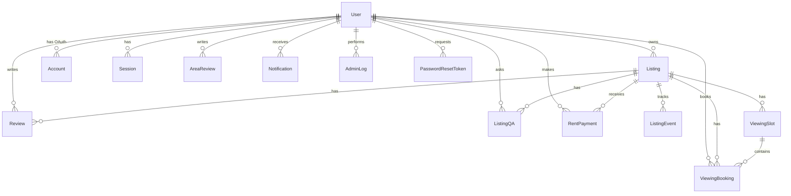

### Key Models Explained

#### 1. User Model
```prisma
model User {
  id               String    @id @default(cuid())
  email            String?   @unique
  passwordHash     String?           // bcrypt hashed, never stored plain
  role             String    @default("USER")  // USER or ADMIN
  documentStatus   String    @default("UNVERIFIED")
  documentVerified Boolean   @default(false)
  documentType     String?           // AADHAAR, PASSPORT, VOTER_ID
  documentNumber   String?           // 12-digit Aadhaar or passport number
  documentUrl      String?           // ID document scan URL
  legalName        String?           // Legal name for verification
  lifestyleProfile String?           // JSON of roommate quiz answers

  // Relations
  listings         Listing[]
  reviews          Review[]
  notifications    Notification[]
  accounts         Account[]   // OAuth provider accounts
}
```

**Design decisions explained:**
- **`cuid()` for IDs** — Collision-resistant Unique IDs. Unlike auto-increment (`1, 2, 3`), CUIDs are random strings like `clxy7abc...`. This prevents **enumeration attacks** (an attacker can't guess `/users/2`, `/users/3`).
- **`passwordHash` is nullable** — Google OAuth users don't have passwords. Making it optional allows both auth strategies.
- **`role` as String, not Enum** — Adding a new role (e.g., `MODERATOR`) only needs a code change, not a database migration.
- **`documentVerified` as separate Boolean** — Allows quick `WHERE documentVerified = true` queries without parsing the status string.
- **`lifestyleProfile` as JSON string** — Flexible schema for the roommate quiz (sleep schedule, cleanliness, diet, etc.) without needing separate columns.

#### 2. Listing Model
```prisma
model Listing {
  id                 String    @id @default(cuid())
  title              String
  description        String
  category           String            // HOUSE, FLAT, PG, HOTEL, HOSTEL, etc.
  price              Float
  lat                Float             // Latitude for map
  lng                Float             // Longitude for map
  address            String
  area               String
  city               String?
  state              String?
  contactNumber      String
  whatsappNumber     String?
  facilities         String  @default("{}")  // JSON blob for category-specific attributes
  images             String            // JSON array of image URLs
  status             String  @default("PENDING")  // PENDING → APPROVED/REJECTED
  aiFraudScore       Int?              // 0-99 from AI fraud detector
  aiFraudFlags       String?           // JSON array of fraud warnings
  expiresAt          DateTime?         // Auto-cleanup for expired listings
  requireVerification Boolean @default(false)
  
  // Hotel sharing fields
  isSharedHotelRoom  Boolean @default(false)
  hotelSplitStatus   String  @default("AVAILABLE")
  hotelName          String?
  hotelBookingRef    String?
  checkInDate        DateTime?
  checkOutDate       DateTime?
  
  // Roommate fields
  roommateType       String?   // HAVE_ROOM or NEED_ROOM
  roommateGender     String?   // MALE, FEMALE, ANY
  
  // Relations
  userId             String
  user               User @relation(fields: [userId], references: [id])
  reviews            Review[]
  events             ListingEvent[]
  
  @@index([userId])          // Fast lookup by owner
  @@index([status])          // Fast filtering by approval status
  @@index([category, city])  // Compound index for category+city search
}
```

**Design decisions:**
- **`facilities` as JSON** — Different categories need different fields (PG needs `foodType`, Hotel needs `starRating`). Using a JSON blob avoids schema changes for each category. This is called **denormalization** — trading strict normalization for developer flexibility.
- **`images` as JSON array string** — A listing can have 1-5 images; storing as a JSON array avoids a separate `ListingImage` junction table.
- **Compound index `@@index([category, city])`** — Optimizes the most common query pattern (browse by category in a city). Without this, the database would do a **full table scan**.
- **`status` workflow**: `PENDING → APPROVED/REJECTED` — All new listings require admin approval (prevents spam).

**Real-world analogy:** The `facilities` JSON field is like a **custom notes section on a form** — each property type fills in different details, but they all go in the same box.

#### 3. Supporting Models

| Model | Purpose | Key Fields |
|-------|---------|-----------|
| `Account` | OAuth provider records (Google) | `provider`, `providerAccountId`, `access_token` |
| `Session` | Database sessions (used by NextAuth adapter) | `sessionToken`, `expires` |
| `PasswordResetToken` | Secure password reset links | `email`, `token` (crypto hex), `expires` |
| `Review` | User reviews on listings | `rating` (1-5), `comment`, `userId`, `listingId` |
| `ListingQA` | Q&A threads on listings | `question`, `answer`, `isOwnerAnswer` |
| `ListingEvent` | Analytics events | `eventType` (VIEW/CLICK/CONNECT), `listingId` |
| `ViewingSlot` | Available viewing times | `date`, `startTime`, `endTime`, `maxBookings` |
| `ViewingBooking` | Booked viewings | `slotId`, `userId`, `status` |
| `RentPayment` | Rent payment tracking | `amount`, `month`, `paymentProofUrl` |
| `Notification` | In-app notifications | `title`, `message`, `read`, `userId` |
| `AdminLog` | Audit trail for admin actions | `adminId`, `action`, `targetType`, `details` |
| `SiteSettings` | CMS-editable platform content | `heroTitle`, `footerText`, `adsenseId` |
| `Feedback` | Contact form submissions | `name`, `email`, `message` |
| `AreaReview` | Locality reviews by residents | `area`, `city`, `rating`, `review` |

### Prisma Singleton Pattern

```typescript
// src/lib/prisma.ts
const globalForPrisma = global as unknown as { prisma: PrismaClient };

export const prisma =
  globalForPrisma.prisma ||
  new PrismaClient({ log: ['error', 'warn'] });

if (process.env.NODE_ENV !== 'production') globalForPrisma.prisma = prisma;
```

> **Interviewer**: "Why do you store Prisma on `global`?"

**Problem:** Next.js hot-reloads modules during development. Each reload creates a new `PrismaClient`, opening new database connections. After 10 reloads, you've exhausted the database connection pool (Supabase free tier allows only ~20 connections).

**Solution:** Store the client on Node.js's `global` object, which persists across hot reloads. In production, modules are loaded once, so this isn't needed — but the pattern is safe either way.

**Real-world analogy:** It's like keeping a **single key to the office** on a hook by the door, instead of cutting a new key every time someone enters.

---

## 6. Authentication System (NextAuth.js)

### How Authentication Works

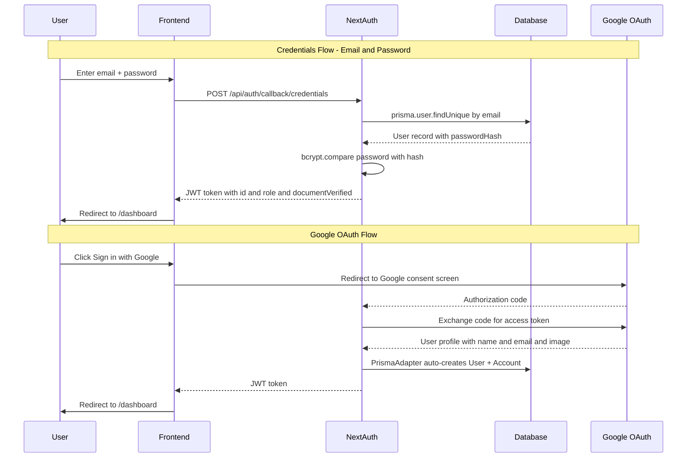

### Key Concepts

#### JWT Strategy
```typescript
session: {
  strategy: 'jwt',  // Stateless — no session table lookups
}
```

> **Interviewer**: "Why JWT instead of database sessions?"

**JWT (JSON Web Token)** stores the session data **inside the token itself** (encrypted). The server doesn't need to query the database on every request to check "Is this user logged in?"

| Aspect | JWT | Database Sessions |
|--------|-----|-------------------|
| Speed | ✅ No DB query per request | ❌ DB query per request |
| Scalability | ✅ Stateless, works across servers | ❌ Needs shared session store |
| Revocation | ❌ Can't instantly invalidate | ✅ Delete from DB = instant logout |
| Size | ❌ Token grows with data | ✅ Fixed small cookie |

**For Toolate**, JWT is chosen because Supabase's free tier has limited connections — reducing unnecessary DB queries is critical.

**Real-world analogy:** JWT is like a **boarding pass** — it contains your name, seat, and flight info. The airline doesn't check a database when you board; they just verify the barcode. Database sessions are like a **guest list** — every time you enter, the bouncer checks your name against the list.

#### bcrypt Password Hashing

```typescript
const passwordHash = await bcrypt.hash(password, 10);  // 10 salt rounds
const isCorrect = await bcrypt.compare(password, user.passwordHash);
```

> **Interviewer**: "Why bcrypt and not SHA-256?"

- **SHA-256 is fast** — attackers can compute billions of hashes per second (GPU brute-force)
- **bcrypt is intentionally slow** — 10 salt rounds means ~100ms per hash. An attacker trying 1 billion passwords would need ~3 years
- **Salt** — bcrypt automatically generates a random salt per password, so identical passwords produce different hashes. Even if two users have password "123456", their hashes are completely different.

**Real-world analogy:** bcrypt is like a **lock with 10 deadbolts** — each one takes time to open, making brute force impractical.

#### JWT Callbacks — Custom Claims

```typescript
callbacks: {
  async jwt({ token, user, trigger, session }) {
    if (user) {
      token.id = user.id;
      token.role = (user as any).role;
      token.documentVerified = (user as any).documentVerified;
    }
    if (trigger === 'update' && session) {
      if (session.role) token.role = session.role;
      if (session.documentVerified !== undefined)
        token.documentVerified = session.documentVerified;
    }
    return token;
  },
}
```

This adds `role` and `documentVerified` to the JWT so that:
- **Middleware** can check `token.role === 'ADMIN'` without a DB query
- **Components** can show/hide verified badges without an API call
- The `trigger === 'update'` branch allows **dynamic session updates** (e.g., after identity verification, the badge appears immediately without re-login)

---

## 7. OTP Verification Workflow

> **Interviewer**: "How does your OTP system work?"

File: `src/app/api/auth/send-otp/route.ts`

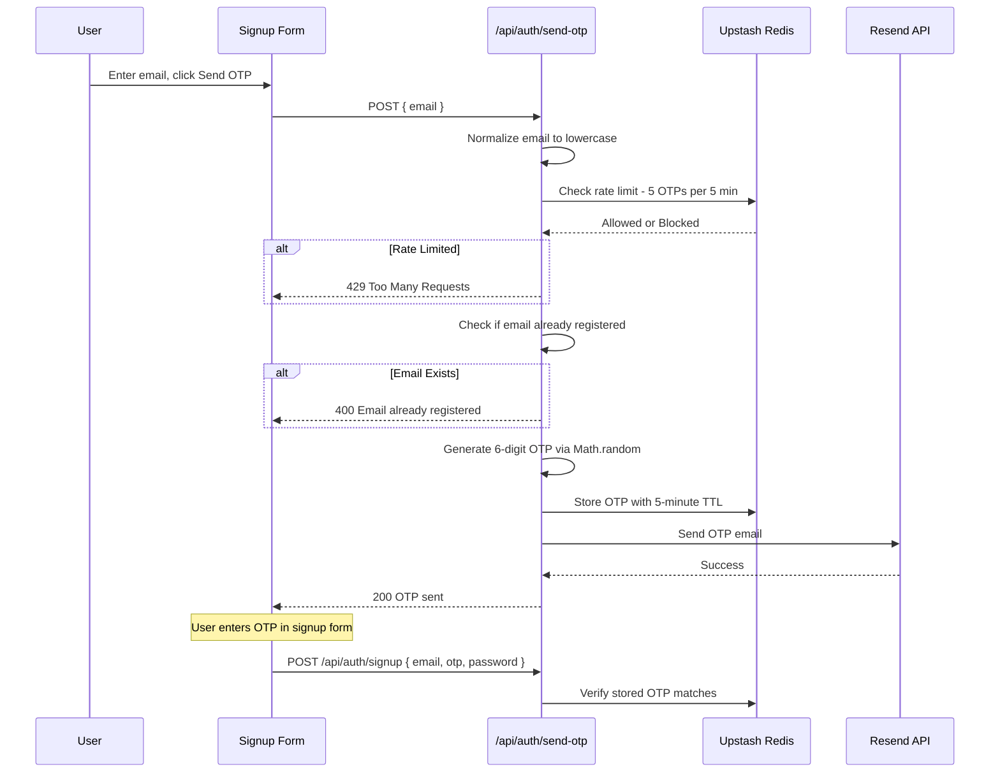

### Key Implementation Details

1. **OTP Generation:**
```typescript
const otp = Math.floor(100000 + Math.random() * 900000).toString();
// Always produces a 6-digit number (100000-999999)
```

2. **Redis Storage with TTL (Time To Live):**
```typescript
await redis.set(`otp:${normalizedEmail}`, otp, { ex: 300 }); // Expires in 5 minutes
```
After 300 seconds, Redis **automatically deletes** the OTP — no cleanup code needed.

3. **Development Mode Bypass:**
```typescript
if (isDev) {
  console.warn(`[DEVELOPMENT] Bypassing email. OTP: ${otp}`);
  return NextResponse.json({ success: true, devOtp: otp }); // Returns OTP in response
}
```
In local development, if email sending fails, the OTP is returned in the API response and logged to the console.

**Real-world analogy:** OTP is like a **temporary visitor badge** at an office — it's valid for a short time, tied to your identity, and used once to verify you're who you claim to be.

---

## 8. Password Reset with Cryptographic Tokens

> **Interviewer**: "How does forgot password work securely?"

File: `src/app/api/auth/forgot-password/route.ts`

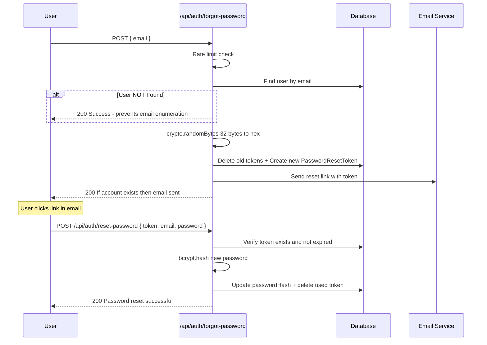

### Security Features

1. **Cryptographically secure token:**
```typescript
const token = crypto.randomBytes(32).toString('hex');
// Produces 64-character hex string like "a3f2b1c4d5e6..."
// 256 bits of entropy — impossible to guess (2^256 possibilities)
```

2. **Email Enumeration Prevention:**
```typescript
if (!user) {
  // Return success even if user doesn't exist
  return NextResponse.json({
    success: true,
    message: 'If an account is registered with this email, a password reset link has been sent.',
  });
}
```

> **Interviewer**: "Why return success for non-existent emails?"

If we returned "Email not found", an attacker could **enumerate** which emails are registered by trying different addresses. By always returning success, the attacker can't distinguish registered from unregistered emails.

**Real-world analogy:** It's like a **bank's security policy** — whether you have an account or not, they always say "We'll process your request" to prevent information leakage.

3. **One-time use tokens:** After password reset, the token is deleted from the database — it cannot be reused.

4. **Token expiry:** Tokens expire after 1 hour (`Date.now() + 3600 * 1000`).

---

## 9. API Design — REST Routes & HTTP Methods

> **Interviewer**: "Explain REST API design principles used in your project."

### HTTP Methods Used

| Method | Endpoint | Purpose | Idempotent? |
|--------|----------|---------|-------------|
| `GET` | `/api/listings` | Browse/search listings | ✅ Yes |
| `GET` | `/api/listings/[id]` | Get single listing | ✅ Yes |
| `POST` | `/api/listings` | Create new listing | ❌ No |
| `PUT` | `/api/listings/[id]` | Update entire listing | ✅ Yes |
| `DELETE` | `/api/listings/[id]` | Remove listing | ✅ Yes |
| `POST` | `/api/auth/send-otp` | Generate & send OTP | ❌ No |
| `POST` | `/api/upload` | Upload images | ❌ No |
| `PUT` | `/api/notifications` | Mark notifications read | ✅ Yes |
| `POST` | `/api/listings/[id]/events` | Log analytics event | ❌ No |

> **Interviewer**: "What does idempotent mean?"

An **idempotent** operation produces the **same result** regardless of how many times it's called. `GET /listings/abc` always returns the same listing. `DELETE /listings/abc` deletes it once — calling it again still returns success (or 404). `POST /listings` is **not** idempotent because each call creates a new listing.

**Real-world analogy:** Pressing an **elevator button** is idempotent — pressing it 10 times still takes you to the same floor. Ordering **pizza** is not idempotent — each order gets you another pizza.

### Request/Response Format

All APIs follow a consistent pattern:

**Success Response:**
```json
{
  "success": true,
  "message": "Listing created successfully.",
  "listing": { ... }
}
```

**Error Response:**
```json
{
  "error": "Title must be at least 3 characters."
}
```

This consistency makes frontend error handling predictable.

---

## 10. Complete CRUD Lifecycle — Listings

> **Interviewer**: "Walk me through the complete CRUD operations for listings."

File: `src/app/api/listings/[id]/route.ts`

### CREATE (POST)

6-step pipeline: Session → Rate Limit → Zod Validate → AI Fraud Scan → Business Rules → DB Insert

**Status on creation: `PENDING`** — requires admin approval before going live.

### READ (GET) — Single Listing

```typescript
export async function GET(req, { params }) {
  const { id } = await params;
  const listing = await prisma.listing.findUnique({
    where: { id },
    include: { user: { select: { id: true, name: true, email: true, image: true } } },
  });

  // Access control: non-approved listings only visible to owner/admin
  if (listing.status !== 'APPROVED') {
    const session = await getServerSession(authOptions);
    const isOwner = session?.user?.id === listing.userId;
    const isAdmin = session?.user?.role === 'ADMIN';
    if (!isOwner && !isAdmin) {
      return NextResponse.json({ error: 'Listing is pending approval.' }, { status: 403 });
    }
  }
}
```

**Key insight:** Prisma's `include` performs a **SQL JOIN** — it fetches the listing AND its owner's details in a single database query, avoiding the **N+1 query problem**.

### UPDATE (PUT) — Smart Re-Approval

```typescript
const updateData = {
  ...validationResult.data,
  // KEY: If user edits → revert to PENDING. If admin edits → keep current status.
  status: isAdmin ? listing.status : ListingStatus.PENDING,
};
```

> **Interviewer**: "Why does editing a listing revert its status?"

When a user edits an already-approved listing, it goes back to `PENDING` for re-review. This prevents **bait-and-switch attacks** — someone could get an innocent listing approved, then edit it to contain scam content. But admin edits (fixing typos, etc.) don't trigger re-approval.

### DELETE — Ownership Verification

```typescript
const isOwner = listing.userId === userId;
const isAdmin = userRole === Role.ADMIN;

if (!isOwner && !isAdmin) {
  return NextResponse.json({ error: 'Forbidden.' }, { status: 403 });
}

// Admin deletions are audit-logged
if (isAdmin) {
  await prisma.adminLog.create({
    data: { adminId: userId, action: 'DELETE_LISTING', targetId: id, details: `...` },
  });
}
```

---

## 11. Input Validation with Zod

> **Interviewer**: "How do you validate user input?"

```typescript
const signupSchema = z.object({
  name: z.string().min(2, 'Name must be at least 2 characters.'),
  email: z.string().email('Invalid email address.'),
  password: z.string().min(6, 'Password must be at least 6 characters.'),
  otp: z.string().length(6, 'OTP must be 6 digits.').optional().or(z.literal('')),
  recaptchaToken: z.string().min(1, 'reCAPTCHA token is required.'),
});
```

**Why Zod over manual `if` checks?**

1. **Declarative** — the schema reads like documentation
2. **Type inference** — `z.infer<typeof signupSchema>` gives you the TypeScript type for free
3. **Composable** — schemas can extend, merge, and transform
4. **Consistent error format** — `validationResult.error.issues.map(e => e.message).join(' ')`
5. **Works on both client and server** — same validation in React Hook Form (browser) and API route (server)

### Validation Rules Used in Toolate

| Field | Rule | Regex/Constraint |
|-------|------|-----------------|
| Indian phone | `z.string().regex(/^[6-9]\d{9}$/)` | Must start with 6-9, exactly 10 digits |
| Latitude | `z.number().min(-90).max(90)` | Valid GPS range |
| Longitude | `z.number().min(-180).max(180)` | Valid GPS range |
| Images | `z.array(z.string().url()).min(1).max(5)` | 1-5 valid URLs |
| Price | `z.number().nonnegative()` | Must be ≥ 0 |
| Aadhaar | `/^\d{12}$/` | Exactly 12 digits |
| Passport | `/^[A-Z0-9]{8,9}$/i` | 8-9 alphanumeric |
| Voter ID | `/^[A-Z]{3}\d{7}$/i` | 3 letters + 7 digits (EPIC format) |

### safeParse vs parse

```typescript
// parse: throws ZodError on failure (use in trusted contexts)
const data = schema.parse(body);

// safeParse: returns { success, data, error } (use in API routes)
const result = schema.safeParse(body);
if (!result.success) {
  return NextResponse.json({ error: result.error.issues.map(e => e.message).join(' ') }, { status: 400 });
}
```

Toolate uses `safeParse` in all API routes because it allows **graceful error handling** without try-catch.

---

## 12. Security Measures — Defense in Depth

> **Interviewer**: "How many layers of security does your app have?"

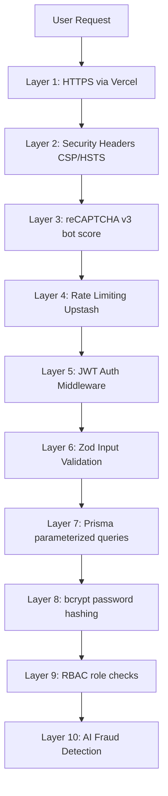

### Layer-by-Layer Breakdown

| Layer | Technology | Attack Prevented |
|-------|-----------|-----------------|
| 1. HTTPS | Vercel auto-TLS | Man-in-the-middle sniffing |
| 2. CSP Headers | Content-Security-Policy | Cross-Site Scripting (XSS) |
| 3. reCAPTCHA v3 | Google invisible scoring | Automated bot attacks |
| 4. Rate Limiting | Upstash sliding window | Brute force, DoS |
| 5. JWT Middleware | NextAuth + proxy.ts | Unauthorized access |
| 6. Zod Validation | Schema-based parsing | Malformed/injected input |
| 7. Parameterized SQL | Prisma ORM | SQL injection |
| 8. bcrypt | 10-round salted hashing | Password database breach |
| 9. RBAC | Role checks in API + middleware | Privilege escalation |
| 10. AI Fraud | Claude + heuristics | Scam/phishing listings |

### Security Headers

| Header | Value | Protection |
|--------|-------|-----------|
| `X-Frame-Options` | `DENY` | Prevents clickjacking (embedding site in iframe) |
| `X-Content-Type-Options` | `nosniff` | Prevents MIME-type sniffing attacks |
| `Referrer-Policy` | `strict-origin-when-cross-origin` | Controls what URL info is shared |
| `Permissions-Policy` | `camera=(), microphone=(), geolocation=(self)` | Blocks camera/mic, allows GPS for our site only |

### Email Enumeration Prevention (Applied Everywhere)

The forgot-password endpoint always returns the **same success message** regardless of whether the email exists:
```typescript
return NextResponse.json({
  message: 'If an account is registered with this email, a password reset link has been sent.',
});
```

This prevents attackers from discovering which emails are registered.

---

## 13. Rate Limiting (Upstash Redis)

### Four Rate Limiters

| Limiter | Window | Limit | Key Pattern | Protects Against |
|---------|--------|-------|-------------|-----------------|
| `signupRateLimiter` | 1 hour | 5/IP | `signup:${ip}` | Mass account creation bots |
| `listingRateLimiter` | 1 hour | 10/user | `listing:${userId}` | Spam listing floods |
| `otpRateLimiter` | 5 min | 5/email | `otp-limit:${ip}:${email}` | OTP brute-force |
| `feedbackRateLimiter` | 1 hour | 5/IP | `feedback:${ip}` | Contact form spam |

### Sliding Window Algorithm

> **Interviewer**: "Explain sliding window rate limiting."

**Fixed window:** Count resets at exact intervals. Problem: 5 requests at 11:59 + 5 at 12:01 = 10 requests in 2 minutes.

**Sliding window:** Tracks the **rolling last N minutes**. At any point, only N requests in the **preceding** window are allowed.

```typescript
signupLimiter = new Ratelimit({
  redis: redisClient,
  limiter: Ratelimit.slidingWindow(5, '1 h'),
  analytics: true,
  prefix: '@upstash/ratelimit/signup',
});
```

**Real-world analogy:** Fixed window is like a **parking meter that resets at midnight**. Sliding window is like a **2-hour parking limit** — it always counts 2 hours back from now.

### Resilient Rate Limiting

```typescript
let isRateLimitOk = true;
try {
  const limitRes = await otpRateLimiter.limit(rateLimitKey);
  isRateLimitOk = limitRes.success;
} catch (redisErr) {
  console.error('[RateLimit Error]:', redisErr);
  // If Redis is down, ALLOW the request (fail-open)
}
```

> **Interviewer**: "Why do you fail-open when Redis is down?"

If Redis crashes and we block ALL requests (fail-closed), legitimate users can't use the app. Instead, we **log the error and allow** the request — a brief period without rate limiting is better than complete service outage.

---

## 14. Caching Strategy (Redis + ISR)

### Three Cache Layers

| Layer | Technology | TTL | What's Cached |
|-------|-----------|-----|--------------|
| 1. Redis | Upstash | 1 hour | Site settings (CMS content) |
| 2. Redis | Upstash | 24 hours | Transit station data |
| 3. Redis | Upstash | 30 days | Geocoding results |
| 4. ISR | Next.js | 60 seconds | Homepage HTML |

### Cache-Aside Pattern (Settings)

```typescript
export async function getCachedSettings() {
  const cached = await redis.get('site-settings:default');
  if (cached) return JSON.parse(cached);  // Cache HIT
  
  let settings = await prisma.siteSettings.findUnique({ where: { id: 'default' } });
  await redis.set('site-settings:default', JSON.stringify(settings), { ex: 3600 });
  return settings;
}

export async function invalidateSettingsCache() {
  await redis.del('site-settings:default');  // Called on admin update
}
```

**Cache key design for geocoding:**
```typescript
const cacheKey = `geocode:search:${Buffer.from(normalizedQuery).toString('base64')}`;
// Base64 encoding prevents special characters in Redis keys
```

### ISR — Incremental Static Regeneration

```typescript
export const revalidate = 60; // Homepage revalidates every 60 seconds
```

**How it works:**
1. First visitor gets a **fresh page** (server-rendered)
2. Next visitors in the 60-second window get the **cached version** (instant load)
3. After 60 seconds, the next visitor triggers a **background regeneration** (stale-while-revalidate)

**Real-world analogy:** ISR is like a **newspaper that republishes every hour** — you get the latest edition, but it's not printed fresh for every single reader.

---

## 15. File Upload — Dual Storage Engine

### Upload Flow

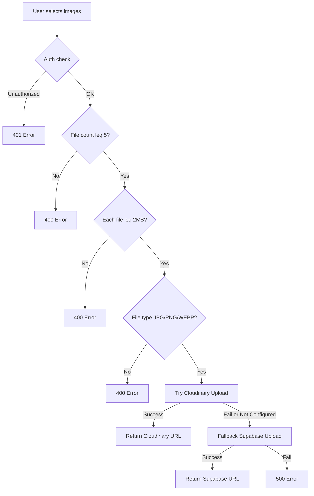

### Cloudinary Signed Upload

```typescript
const paramsToSign = `folder=${folder}&timestamp=${timestamp}${apiSecret}`;
const signature = crypto.createHash('sha1').update(paramsToSign).digest('hex');
```

> **Interviewer**: "Why sign uploads server-side?"

If we let the client upload directly with the API secret, anyone could steal the secret from browser dev tools. **Server-side signing** means:
1. The secret never leaves the server
2. The signature is valid for only a few minutes (timestamp)
3. Cloudinary verifies the signature before accepting the upload

**Real-world analogy:** It's like a **notarized check** — the bank only accepts the check if it has the notary's stamp (signature), which only the notary (server) can produce.

### Supabase Storage Fallback

```typescript
if (!publicUrl) {
  const { data, error } = await supabaseAdmin.storage
    .from('listings')
    .upload(fileName, buffer, { contentType: file.type, upsert: false });
}
```

The dual-storage ensures the user **never sees an upload failure**.

---

## 16. AI-Powered Fraud Detection (Claude API)

### Two-Layer Detection System

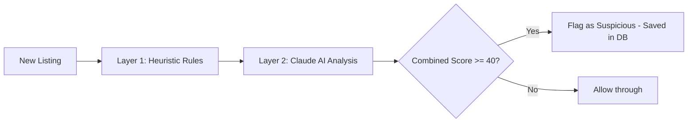

#### Layer 1: Rule-Based Heuristics (India-Specific)

| Pattern | Score | Why It's Suspicious |
|---------|-------|-------------------|
| "Pay first", "deposit before visit" | +45 | Most common rental scam tactic |
| "Army officer", "government transfer" | +40 | Classic urgency/authority excuse |
| "GPay code", "QR code deposit" | +25 | Unconventional payment = likely scam |
| Luxury 2BHK for ₹4000 | +30 | Price-to-value mismatch |
| "Urgent booking", "block today" | +15 | High-pressure sales tactics |

#### Layer 2: Claude AI

```typescript
const systemPrompt = `You are an online safety investigator specializing 
  in Indian rental property scams. Return ONLY a valid JSON object:
  { "isSuspicious": boolean, "confidence": number, "flags": string[] }`;
```

### Graceful Degradation Pattern

```typescript
export async function queryClaude(prompt, systemPrompt, mockResponse) {
  if (!anthropic) {
    await new Promise(resolve => setTimeout(resolve, 800)); // Simulate delay
    return mockResponse;  // Works even without API key
  }
  try {
    return (await anthropic.messages.create({ ... })).content[0].text;
  } catch (error) {
    return mockResponse;  // API failure → fallback
  }
}
```

The app **never crashes** if Claude is unavailable — it gracefully falls back to the mock response.

---

## 17. Roommate Matching Algorithm

### Weighted Compatibility Scoring

```typescript
interface LifestyleProfile {
  sleepSchedule: 'EARLY_BIRD' | 'NIGHT_OWL' | 'FLEXIBLE';
  cleanliness: 'MESSY' | 'MODERATE' | 'NEAT_FREAK';
  guests: 'NEVER' | 'WEEKENDS' | 'ANYTIME';
  smoking: 'SMOKER' | 'NON_SMOKER' | 'TOLERANT';
  diet: 'VEG' | 'NON_VEG' | 'JAIN' | 'EAT_OUT';
  noiseTolerance: 'QUIET' | 'MODERATE' | 'LOUD';
}
```

| Factor | Weight | Match Logic |
|--------|--------|-------------|
| Cleanliness | 20 | Same = +20, one Moderate = +12, Messy vs Neat = **-5** |
| Smoking | 20 | Same = +20, one Tolerant = +15, Smoker vs Non = **-10** |
| Sleep | 15 | Same = +15, one Flexible = +10, opposite = 0 |
| Guests | 15 | Same = +15, Weekends = +10 |
| Diet | 15 | Same = +15, Veg/Jain similar = +12 |
| Noise | 15 | Same = +15, one Moderate = +10, Quiet vs Loud = **-5** |

**Total max score: 100.** Negative scores are clamped to 0.

> **Interviewer**: "Why negative weights for some combinations?"

Negative scores represent **deal-breakers**. A non-smoker paired with a heavy smoker gets a -10 penalty, ensuring the match score drops below 20% — accurately reflecting that this pairing rarely works in shared Indian housing.

**Real-world analogy:** This is similar to **dating app algorithms** — they don't just count matches, they penalize incompatible traits.

---

## 18. Geospatial Search — Haversine Formula

> **Interviewer**: "How do you calculate distance between two GPS coordinates?"

File: `src/app/listings/page.tsx`

```typescript
function calculateDistance(lat1: number, lon1: number, lat2: number, lon2: number) {
  const R = 6371; // Earth's radius in kilometers
  const dLat = (lat2 - lat1) * Math.PI / 180;
  const dLon = (lon2 - lon1) * Math.PI / 180;
  const a =
    Math.sin(dLat / 2) * Math.sin(dLat / 2) +
    Math.cos(lat1 * Math.PI / 180) * Math.cos(lat2 * Math.PI / 180) *
    Math.sin(dLon / 2) * Math.sin(dLon / 2);
  const c = 2 * Math.atan2(Math.sqrt(a), Math.sqrt(1 - a));
  return R * c; // Distance in km
}
```

**The Haversine Formula** calculates the **great-circle distance** between two points on a sphere (Earth).

> **Interviewer**: "Why not just use `sqrt((x2-x1)² + (y2-y1)²)`?"

Euclidean distance treats the surface as **flat**. At large distances (e.g., Bangalore to Delhi), the Earth's curvature causes significant error. Haversine accounts for this by using trigonometric functions.

**Used in Toolate for:**
1. **"Near Me" GPS search** — User shares location, listings within a 10km radius are shown
2. **Distance badges** — Each listing card shows "📍 2.3km" from the user

### In-Memory Filtering for Geo Search

```typescript
// 1. Fetch ALL matching listings from DB
const dbListings = await prisma.listing.findMany({ where, orderBy });

// 2. Calculate distance for each
const parsed = dbListings.map(l => ({
  ...l,
  distance: calculateDistance(lat, lng, l.lat, l.lng),
}));

// 3. Filter by radius
const nearby = parsed.filter(l => l.distance <= radius);

// 4. Sort by distance (closest first)
nearby.sort((a, b) => a.distance - b.distance);

// 5. Paginate
return nearby.slice(skip, skip + limit);
```

> **Interviewer**: "Why not do distance calculation in SQL?"

PostgreSQL has `PostGIS` extension for geospatial queries, but Supabase's free tier doesn't easily support it. Calculating in JavaScript with all listings loaded into memory works well for thousands of listings. For millions, we'd need PostGIS or Elasticsearch.

---

## 19. Commute-Based Search — OSRM Routing

> **Interviewer**: "How does the commute filter work?"

File: `src/app/listings/page.tsx` (lines 194-231)

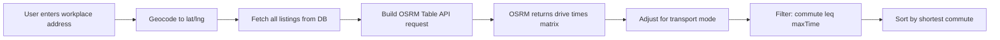

### OSRM Table API

```typescript
const coordsString = [
  `${workplaceLng},${workplaceLat}`,  // Source: workplace
  ...listings.map(l => `${l.lng},${l.lat}`),  // Destinations: all listings
].join(';');

const url = `https://router.project-osrm.org/table/v1/driving/${coordsString}?sources=0&annotations=duration`;
```

This makes a **single API call** that returns drive times from the workplace to ALL listings simultaneously — much more efficient than N separate route calculations.

### Transport Mode Adjustment

```typescript
let factor = 1.0;  // Driving baseline
if (commuteMode === 'walking') factor = 6.0;  // Walking is ~6x slower
if (commuteMode === 'bike') factor = 0.85;    // Cycling is slightly faster
```

### Fallback: Straight-Line Estimation

If OSRM returns `null` for a route (no road connection), the system falls back to a simple speed-based estimate:
```typescript
const dist = calculateDistance(workplaceLat, workplaceLng, listing.lat, listing.lng);
const speed = mode === 'walking' ? 5 : mode === 'bike' ? 25 : 35; // km/h
const seconds = (dist / speed) * 3600 * 1.3; // 1.3x factor for road winding
```

---

## 20. Transit Proximity (Overpass API)

Queries OpenStreetMap's Overpass API for nearby public transit:
```
node["railway"="station"](around:1500,lat,lng);
node["public_transport"="station"](around:1500,...);
node["highway"="bus_stop"](around:1500,...);
```

Results are cached in Redis for 24 hours. If the API fails, **mock data** is returned (graceful degradation).

---

## 21. Maps & Geolocation (Leaflet + Nominatim)

### Why Leaflet instead of Google Maps?

| Feature | Google Maps | Leaflet + OpenStreetMap |
|---------|------------|----------------------|
| Cost | $7 per 1000 loads after free tier | **$0 forever** |
| API Key | Required, credit card needed | **Not needed** |
| Data source | Google proprietary | OpenStreetMap (community) |

### Geocoding Proxy with Caching

```typescript
// /api/geocode/search/route.ts
const cacheKey = `geocode:search:${Buffer.from(query).toString('base64')}`;

// Try Redis cache (30-day TTL)
const cached = await redis.get(cacheKey);
if (cached) return NextResponse.json(JSON.parse(cached));

// Cache miss → query Nominatim
const data = await fetch(`https://nominatim.openstreetmap.org/search?q=${query}&format=json`);

// Cache for 30 days
await redis.set(cacheKey, JSON.stringify(data), { ex: 2592000 });
```

> **Interviewer**: "Why proxy Nominatim through your own API?"

1. **Rate limiting** — Nominatim has a strict 1 request/second policy; our proxy adds controlled access
2. **Caching** — Geocoding the same address repeatedly wastes API calls; Redis caches results for 30 days
3. **Security** — Hides the third-party API from direct client access

---

## 22. Email System (Resend + Nodemailer)

### Priority-Based Fallback

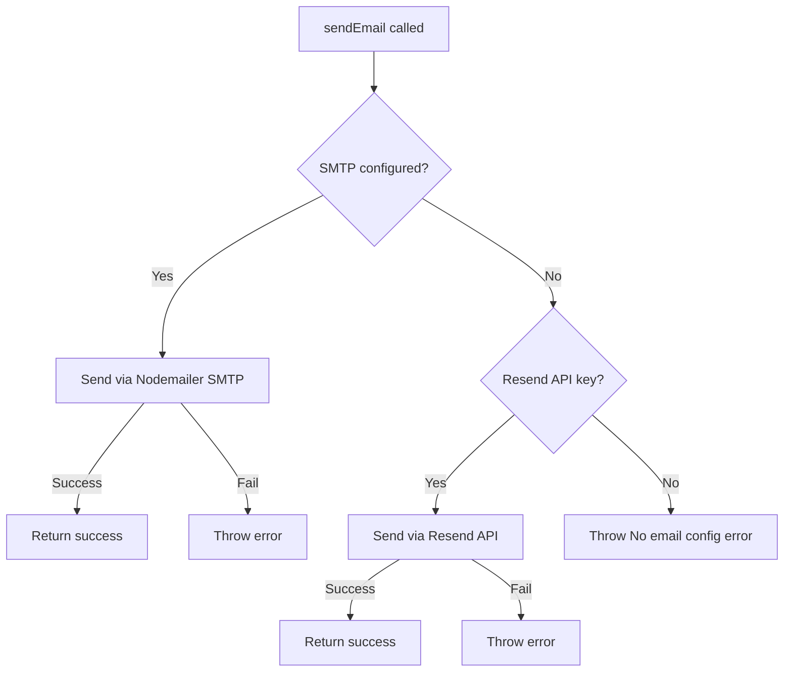

### Email Templates Used

| Email | Trigger | Content |
|-------|---------|---------|
| OTP Verification | Signup | 6-digit code with brand styling |
| Password Reset | Forgot password | Clickable reset link, 1-hour expiry |
| Listing Expired | Cron job | Notification with dashboard link |
| Welcome Email | Account creation | Onboarding information |

---

## 23. Progressive Web App (PWA)

> **Interviewer**: "What is a PWA and why did you implement it?"

A PWA has three requirements:
1. **HTTPS** — secured connection (Vercel provides this)
2. **Service Worker** — background script that caches assets
3. **Web Manifest** — JSON file describing app name, icons, theme

### Toolate's PWA Configuration

```typescript
const withPWA = withPWAInit({
  dest: 'public',
  disable: process.env.NODE_ENV === 'development',
  register: true,
  cacheOnFrontEndNav: true,
  aggressiveFrontEndNavCaching: true,
  reloadOnOnline: true,
});
```

**Benefits:**
- **Installable** — Users can add to home screen (looks like a native app)
- **Offline support** — Previously visited pages work without internet
- **Fast navigation** — Cached assets load instantly
- **No App Store** — No review process, instant updates

---

## 24. SEO Implementation

### Dynamic Sitemap

```typescript
export default async function sitemap(): Promise<MetadataRoute.Sitemap> {
  const staticRoutes = ['', '/listings', '/about', '/contact', '/privacy', '/terms']
    .map(route => ({
      url: `${baseUrl}${route}`,
      changeFrequency: 'daily',
      priority: route === '' ? 1.0 : 0.8,
    }));

  const listings = await prisma.listing.findMany({
    where: { status: 'APPROVED' },
    select: { id: true, updatedAt: true },
  });

  const dynamicRoutes = listings.map(l => ({
    url: `${baseUrl}/listings/${l.id}`,
    changeFrequency: 'weekly',
    priority: 0.6,
  }));

  return [...staticRoutes, ...dynamicRoutes];
}
```

### Robots.txt

```typescript
disallow: ['/admin/', '/api/', '/dashboard/', '/login', '/signup']
```

Tells search engines to **not index** private pages.

---

## 25. Admin Panel & Role-Based Access Control

### Triple-Layer Protection

```
Layer 1: Middleware (proxy.ts) — blocks /admin for non-ADMIN JWT tokens
Layer 2: Server Component — checks session.user.role !== 'ADMIN' → redirect('/')
Layer 3: API Route — checks session.user.role !== 'ADMIN' → 403 Forbidden
```

### Admin Features

| Feature | Purpose |
|---------|---------|
| Platform stats | User count, listing count, pending count |
| User moderation | View/ban/delete users |
| Listing moderation | Approve/reject pending listings |
| Site Settings CMS | Edit hero text, footer, meta tags |
| Feedback inbox | View/reply to contact messages |
| Audit logs | Track all admin actions |

### Parallel Data Fetching

```typescript
const [userCount, listingCount, pendingCount, approvedCount, usersList, recentLogs] = 
  await Promise.all([
    prisma.user.count(),
    prisma.listing.count(),
    prisma.listing.count({ where: { status: 'PENDING' } }),
    prisma.listing.count({ where: { status: 'APPROVED' } }),
    prisma.user.findMany({ ... }),
    prisma.adminLog.findMany({ ... }),
  ]);
```

6 queries run **simultaneously** in ~200ms instead of ~1200ms sequentially.

---

## 26. Identity Verification System

File: `src/app/api/user/verify-id/route.ts`

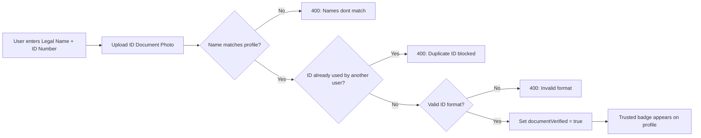

### Anti-Fraud Measures

1. **Name matching:** `legalName` must match profile `name` (normalized: lowercase, trimmed)
2. **Duplicate check:** `prisma.user.findFirst({ where: { documentNumber: id, documentStatus: 'VERIFIED', NOT: { id: userId } } })`
3. **Format validation:** Aadhaar (12 digits), Passport (8-9 alphanumeric), Voter ID (3 letters + 7 digits)
4. **Auto-revocation:** Changing profile name revokes verification badge

---

## 27. Hotel Cost-Sharing Feature

### Business Logic

1. **Already booked:** User has hotel booking → uploads proof → verified users can request 50/50 split
2. **Co-stay query:** User seeks travel partner → no proof needed → both book together

```typescript
if (category === 'HOTEL' && isSharedHotelRoom) {
  if (isAlreadyBooked) {
    requireVerification = true;
    // Must provide: hotelName, bookingRef, dates, proof
  }
}
```

---

## 28. Notification System & Polling

> **Interviewer**: "How does the notification system work?"

File: `src/components/Navbar.tsx`

### Polling Architecture

```typescript
useEffect(() => {
  if (status === 'authenticated') {
    fetchNotifications();                            // Initial fetch
    const timer = setInterval(fetchNotifications, 15000); // Poll every 15 seconds
    return () => clearInterval(timer);               // Cleanup on unmount
  }
}, [status]);
```

**Why polling instead of WebSockets?**
- Vercel serverless functions are **stateless** — they can't maintain persistent WebSocket connections
- 15-second polling is acceptable for notification use cases
- For real-time features, Supabase Realtime (WebSocket) could be added later

### Optimistic UI Update

```typescript
const markOneRead = async (id: string) => {
  const res = await fetch('/api/notifications', { method: 'PUT', body: JSON.stringify({ notificationId: id }) });
  if (res.ok) {
    setNotifications(prev => prev.map(n => (n.id === id ? { ...n, read: true } : n)));
    // UI updates IMMEDIATELY without waiting for re-fetch
  }
};
```

**Real-world analogy:** It's like **marking an email as read** — the UI changes instantly even though the server might take a moment to sync.

---

## 29. Listing Comparison Feature

> **Interviewer**: "How does the compare feature work across pages?"

File: `src/components/CompareBar.tsx`

### Cross-Page State via localStorage + Custom Events

```typescript
// CompareButton.tsx — Add/remove listing from comparison
localStorage.setItem('toolate_compare', JSON.stringify(updatedIds));
window.dispatchEvent(new CustomEvent('compare-updated'));

// CompareBar.tsx — Listen for changes
useEffect(() => {
  const handleUpdate = () => syncFromStorage();
  window.addEventListener('compare-updated', handleUpdate);
  window.addEventListener('storage', handleUpdate);  // Cross-tab sync!
  return () => {
    window.removeEventListener('compare-updated', handleUpdate);
    window.removeEventListener('storage', handleUpdate);
  };
}, []);
```

**Key insights:**
1. **`localStorage`** persists comparison list across page navigations (no server state needed)
2. **`CustomEvent('compare-updated')`** notifies other components in the **same tab** when the list changes
3. **`window.addEventListener('storage')`** syncs across **different browser tabs** — if you add a listing in Tab 1, Tab 2 sees it too

---

## 30. Analytics & View Tracking

File: `src/components/ListingViewTracker.tsx`

### Fire-and-Forget Pattern

```typescript
export default function ListingViewTracker({ listingId }: { listingId: string }) {
  useEffect(() => {
    // Fire-and-forget: don't await, don't block rendering
    fetch(`/api/listings/${listingId}/events`, {
      method: 'POST',
      headers: { 'Content-Type': 'application/json' },
      body: JSON.stringify({ eventType: 'VIEW' }),
    }).catch(err => console.error('View tracking error:', err));
  }, [listingId]);

  return null; // Renders nothing — pure side-effect component
}
```

> **Interviewer**: "What is a fire-and-forget pattern?"

The component sends an analytics event to the API **without awaiting the response**. If it fails, it logs the error and moves on — a tracking failure should never break the user experience.

**Real-world analogy:** It's like a **security camera** — it records quietly in the background. If it fails, the building still functions normally.

---

## 31. Cron Jobs & Auto-Expiry

File: `src/app/api/cron/expire-listings/route.ts`

### Vercel Cron Configuration

```json
{
  "crons": [{
    "path": "/api/cron/expire-listings",
    "schedule": "0 0 * * *"
  }]
}
```

### How It Works

1. **Find expired listings:** `expiresAt <= now AND status IN ('APPROVED', 'PENDING')`
2. **Hard delete** (not soft delete) — removes from database completely
3. **Send expiry emails** to landlords with dashboard link
4. **Secret-based auth:** `CRON_SECRET` header prevents unauthorized triggers

```typescript
const isAuthorized = cronSecret && 
  (secret === cronSecret || authHeader === `Bearer ${cronSecret}`);

if (process.env.NODE_ENV === 'production' && !isAuthorized) {
  return NextResponse.json({ error: 'Unauthorized' }, { status: 401 });
}
```

---

## 32. Middleware & Route Protection

```typescript
export default withAuth(
  function proxy(req) {
    if (req.nextUrl.pathname.startsWith('/admin') && req.nextauth.token?.role !== 'ADMIN') {
      return NextResponse.redirect(new URL('/', req.url));
    }
    return NextResponse.next();
  },
  { callbacks: { authorized: ({ token }) => !!token } }
);

export const config = {
  matcher: ['/dashboard/:path*', '/listings/create/:path*', '/listings/edit/:path*', '/admin/:path*'],
};
```

> **Interviewer**: "How does middleware work in Next.js?"

Middleware runs **before every matching request** at the edge (CDN level). It's the **first line of defense** — before the page even starts rendering, the middleware checks authorization.

**Real-world analogy:** Middleware is like the **reception desk at a corporate office** — it checks your ID badge before you can enter any floor.

---

## 33. Frontend Patterns & Component Architecture

### Component Categories

| Type | Examples | Purpose |
|------|---------|---------|
| **Server Components** | `page.tsx`, `layout.tsx` | Data fetching, zero client JS |
| **Client Components** | `Navbar.tsx`, `ListingFilters.tsx` | Interactive UI with state |
| **Utility Components** | `SafeImage.tsx`, `Providers.tsx` | Reusable building blocks |
| **Feature Components** | `ListingForm.tsx` (102KB!), `ViewingScheduler.tsx` | Complex business logic |
| **Headless Components** | `ListingViewTracker.tsx`, `CompareBar.tsx` | Side effects only |

### SafeImage — Error Boundary Pattern

```typescript
export default function SafeImage({ src, alt, category }) {
  const [hasError, setHasError] = useState(false);

  if (!isValidImage || hasError) {
    // Show category-specific fallback (icon + gradient)
    return <div className="fallback">{getCategoryIcon(category)}</div>;
  }

  return  setHasError(true)} />;
}
```

If a Cloudinary/Supabase image URL fails (404, CORS error), the component **gracefully degrades** to a branded placeholder with the category icon.

### ImageCarousel — State Machine Pattern

```typescript
const [currentIndex, setCurrentIndex] = useState(0);
const [hasError, setHasError] = useState<Record<number, boolean>>({});
const [loadedIndexes, setLoadedIndexes] = useState<Record<number, boolean>>({});
```

Uses **three pieces of state** that work together like a **state machine**:
- `currentIndex` — which slide is shown
- `hasError[index]` — which images failed to load
- `loadedIndexes[index]` — which images have finished loading

This enables **per-image** loading skeletons and error fallbacks.

---

## 34. React Hooks Deep Dive — Used in Toolate

> **Interviewer**: "Explain the React hooks used in your project."

| Hook | Where Used | Purpose |
|------|-----------|---------|
| `useState` | Everywhere | Component-level state management |
| `useEffect` | `Navbar.tsx`, `ListingViewTracker.tsx` | Side effects (API calls, timers, event listeners) |
| `useRef` | `Navbar.tsx`, `ImageCarousel.tsx` | DOM references (click-outside detection, image refs) |
| `useCallback` | `SafeImage.tsx` | Memoized event handlers to prevent re-renders |
| `useRouter` | `HomeSearchForm.tsx` | Programmatic navigation |
| `usePathname` | `Navbar.tsx` | Active link highlighting |
| `useSession` | `Navbar.tsx` | Access auth state client-side |

### Click-Outside Detection Pattern

```typescript
// Navbar.tsx
const notifRef = useRef<HTMLDivElement>(null);

useEffect(() => {
  function handleClickOutside(event: MouseEvent) {
    if (notifRef.current && !notifRef.current.contains(event.target as Node)) {
      setShowNotifDropdown(false); // Close dropdown
    }
  }
  document.addEventListener('mousedown', handleClickOutside);
  return () => document.removeEventListener('mousedown', handleClickOutside);
}, []);
```

**How it works:**
1. `useRef` creates a reference to the dropdown DOM element
2. `useEffect` adds a global click listener on mount
3. If a click happens **outside** the ref element, close the dropdown
4. Cleanup function removes the listener on unmount (prevents memory leaks)

### useCallback for Stable References

```typescript
const handleError = useCallback(() => {
  setHasError(true);
}, []);
```

> **Interviewer**: "Why useCallback here?"

Without `useCallback`, a new function is created on every render, causing the `` to re-render unnecessarily. `useCallback` memoizes the function so it's the **same reference** across renders.

### Cleanup Function Pattern

```typescript
useEffect(() => {
  const timer = setInterval(fetchNotifications, 15000);
  return () => clearInterval(timer); // ← CLEANUP: prevents memory leak
}, [status]);
```

> **Interviewer**: "What happens if you don't return a cleanup function?"

The interval would continue running **even after the component unmounts** — it would try to update state on an unmounted component (memory leak) and waste API calls.

---

## 35. Error Handling & Graceful Degradation

> **Interviewer**: "How do you handle errors in your application?"

### Pattern: Every External Service Has a Fallback

| Service | Primary | Fallback | If Both Fail |
|---------|---------|----------|-------------|
| Image Storage | Cloudinary | Supabase Storage | 500 error |
| Email | SMTP (Nodemailer) | Resend API | Log to console (dev) |
| Cache | Upstash Redis | Direct DB query | Slower but works |
| Rate Limiting | Upstash Redis | Allow request (fail-open) | No rate limiting |
| AI Fraud | Claude API | Heuristic rules | Score = 0 |
| Geocoding | Nominatim API | Redis cache | No suggestions |
| Transit | Overpass API | Mock station data | Placeholder icons |

### Try-Catch Wrapping Pattern

Every API route follows this pattern:
```typescript
export async function POST(req: Request) {
  try {
    // Business logic...
    return NextResponse.json({ success: true });
  } catch (error: any) {
    console.error('Descriptive error context:', error);
    return NextResponse.json(
      { error: error.message || 'Internal server error.' },
      { status: 500 }
    );
  }
}
```

### Resilient Redis Pattern

```typescript
try {
  const cached = await redis.get(cacheKey);
  if (cached) return JSON.parse(cached);
} catch (redisErr) {
  console.warn('[Redis Warning] Cache read failed:', redisErr);
  // Continue to database query — don't crash
}
```

---

## 36. TypeScript Concepts Used

> **Interviewer**: "What TypeScript features do you use?"

| Concept | Example | Purpose |
|---------|---------|---------|
| **Interfaces** | `interface SafeImageProps { src?: string; alt: string; }` | Component prop contracts |
| **Type Guards** | `typeof listing.images === 'string'` | Runtime type checking |
| **Generics** | `useState<Record<number, boolean>>({})` | Type-safe state containers |
| **Union Types** | `'EARLY_BIRD' \| 'NIGHT_OWL' \| 'FLEXIBLE'` | Enum-like string literals |
| **Optional Chaining** | `session?.user?.role` | Safe nested access |
| **Nullish Coalescing** | `resolvedParams.query ?? undefined` | Default for null/undefined |
| **Type Assertions** | `(session.user as any).role` | Accessing extended JWT claims |
| **Conditional Types** | `z.string().optional().or(z.literal(''))` | Flexible schema definitions |
| **Promise<T>** | `params: Promise<{ id: string }>` | Async parameter types |
| **Enums** | `enum ListingCategory { HOUSE = 'HOUSE' }` | Type-safe constants |

---

## 37. URL State Management & Shareable Links

> **Interviewer**: "How do you handle complex filtering state on the frontend so users can share their search results?"

File: `src/app/listings/ListingFilters.tsx`

If a user searches for "2BHK in Koramangala under ₹20,000", they should be able to copy the URL and send it to a friend, and the friend should see the exact same filters applied.

**The Implementation Pattern:**

```typescript
export default function ListingFilters() {
  const router = useRouter();
  const searchParams = useSearchParams(); // Read from URL

  // 1. Initialize local React state FROM the URL
  const [query, setQuery] = useState(searchParams.get('query') || '');
  const [city, setCity] = useState(searchParams.get('city') || '');
  const [maxPrice, setMaxPrice] = useState(searchParams.get('maxPrice') || '');

  // 2. Synchronize local state when URL changes (e.g., clicking Back button)
  useEffect(() => {
    setQuery(searchParams.get('query') || '');
    setCity(searchParams.get('city') || '');
    setMaxPrice(searchParams.get('maxPrice') || '');
  }, [searchParams]);

  // 3. On Form Submit, push state TO the URL
  const handleApplyFilters = (e: React.FormEvent) => {
    e.preventDefault();
    const params = new URLSearchParams();
    if (query) params.set('query', query);
    if (city) params.set('city', city);
    if (maxPrice) params.set('maxPrice', maxPrice);
    
    // Updates URL which triggers the Server Component (page.tsx) to re-fetch data
    router.push(`/listings?${params.toString()}`);
  };
}
```

**Why this is a best practice:**
1. **Shareable URLs:** The URL is the **Source of Truth** (`/listings?city=Bangalore&maxPrice=20000`).
2. **Browser History:** Users can use the browser's Back and Forward buttons to navigate through their previous filter combinations.
3. **Server-Side Rendering (SSR):** The Server Component receives the URL params instantly and queries the database before sending HTML to the client, preventing loading spinners.

---

## 38. Data Aggregation & Analytics (Prisma groupBy)

> **Interviewer**: "How do you calculate city-level average rents and generate analytics for your Insights dashboard without crashing the server?"

File: `src/app/insights/page.tsx`

Instead of fetching ALL listings into memory and looping through them to calculate averages (which would crash the server at scale), we push the mathematical computation down to the **Database Engine** (PostgreSQL) using Prisma's `groupBy` aggregation.

```typescript
const cityStats = await prisma.listing.groupBy({
  by: ['city'],                     // Group by the 'city' column
  _avg: { price: true },            // Calculate average rent for each city
  _count: { id: true },             // Count how many listings are in each city
  where: { status: 'APPROVED' },    // Only analyze live listings
});
```

**Performance Benefits:**
- **Network Transfer:** Instead of sending 10,000 listing records over the network to Node.js, the database only sends a small JSON array of 5 cities with their computed averages.
- **Speed:** PostgreSQL is highly optimized in C for grouping and averaging data, doing it orders of magnitude faster than a JavaScript `.reduce()`.

**Handling Empty States gracefully:**
If the database is new or empty, the Insights page falls back to **curated premium Indian market statistics** so the page never looks broken.

---

## 39. Debouncing API Calls (Search Autocomplete)

> **Interviewer**: "When a user types an address into your commute filter, do you hit your geocoding API on every single keystroke? How do you optimize that?"

File: `src/app/listings/ListingFilters.tsx`

If a user types "Koramangala", they type 11 characters. Hitting the Nominatim API 11 times in 2 seconds would lead to instant rate-limiting and terrible performance. 

**The Solution: Debouncing**

```typescript
const [commuteQuery, setCommuteQuery] = useState('');
const [commuteResults, setCommuteResults] = useState([]);

useEffect(() => {
  // 1. Don't search for tiny inputs
  if (!commuteQuery || commuteQuery.length < 3) {
    setCommuteResults([]);
    return;
  }

  // 2. Set a timer (Debounce)
  const delayDebounce = setTimeout(async () => {
    // Only fires if user STOPS typing for 600ms
    const res = await fetch(`/api/geocode/search?q=${commuteQuery}`);
    setCommuteResults(await res.json());
  }, 600);

  // 3. Cleanup function (Crucial)
  // If the user types another letter before 600ms passes, 
  // React runs this cleanup function which CANCELS the previous timer.
  return () => clearTimeout(delayDebounce);
}, [commuteQuery]);
```

**Real-world analogy:** Debouncing is like an **elevator door**. The door waits 3 seconds before closing. Every time a new person walks in, the timer resets to 3 seconds. The door only actually closes when 3 seconds pass *without anyone new arriving*.

---

## 40. Deployment on Vercel

### Build Pipeline

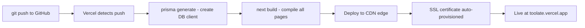

### Vercel Features Used

| Feature | Purpose |
|---------|---------|
| Serverless Functions | API routes run as Lambda-like functions |
| Edge Middleware | Auth checks at CDN level |
| Cron Jobs | Daily listing expiry |
| Environment Variables | All 15+ secrets stored securely |
| Git Push Deploy | Automatic deployment on every push |
| Preview Deployments | Each PR gets its own URL |

---

## 41. Design Patterns Used

| Pattern | Where Used | Explanation |
|---------|-----------|-------------|
| **Singleton** | `prisma.ts` | Single database connection across hot reloads |
| **Strategy** | `mail.ts` | Switch between SMTP and Resend based on config |
| **Chain of Responsibility** | `upload/route.ts` | Cloudinary → Supabase fallback chain |
| **Cache-Aside** | `settings.ts`, `geocode/search` | Redis cache with DB/API fallback |
| **Adapter** | `auth.ts` | PrismaAdapter bridges NextAuth ↔ Prisma |
| **Observer** | `CompareBar.tsx` | Custom events + storage events for cross-component sync |
| **Guard** | `proxy.ts` | Route protection before request reaches handler |
| **Graceful Degradation** | `claude.ts`, `redis.ts`, `transit.ts` | Every external service has a local fallback |
| **Fire and Forget** | `ListingViewTracker.tsx` | Non-blocking analytics tracking |
| **Optimistic Update** | `Navbar.tsx` notifications | UI updates before server confirms |
| **Proxy** | `geocode/search/route.ts` | Server proxies Nominatim API with caching |
| **Builder** | `listings/page.tsx` | Dynamic Prisma `where` clause construction |

---

## 42. HTTP Status Codes Used in Toolate

> **Interviewer**: "What HTTP status codes does your API return?"

| Code | Meaning | When Used |
|------|---------|-----------|
| `200` | OK | Successful GET, PUT, DELETE |
| `201` | Created | Successful POST (new listing created) |
| `400` | Bad Request | Validation failed (Zod), invalid input |
| `401` | Unauthorized | No JWT token, not logged in |
| `403` | Forbidden | Logged in but no permission (not owner/admin) |
| `404` | Not Found | Listing/user doesn't exist |
| `429` | Too Many Requests | Rate limit exceeded |
| `500` | Internal Server Error | Unhandled exception, DB error |

> **Interviewer**: "Difference between 401 and 403?"

- **401 Unauthorized:** "I don't know who you are" — no valid credentials provided
- **403 Forbidden:** "I know who you are, but you don't have permission" — valid JWT but wrong role

**Real-world analogy:** 401 is being stopped at the gate because you **don't have a badge**. 403 is having a badge but trying to enter the **CEO's office** — you're identified but not authorized.

---

## 43. Database Concepts (Interview Essentials)

### ACID Properties in Toolate

> **Interviewer**: "Explain ACID properties with examples from your project."

| Property | Meaning | Toolate Example |
|----------|---------|----------------|
| **Atomicity** | All or nothing | If listing creation fails midway (e.g., after fraud check but before DB insert), nothing is saved |
| **Consistency** | Data always valid | `@unique` constraint on `User.email` prevents duplicate registrations |
| **Isolation** | Concurrent queries don't interfere | Two users creating listings simultaneously don't corrupt each other's data |
| **Durability** | Once committed, data survives crashes | After `prisma.listing.create()` returns, the listing exists even if the server restarts |

### Indexing Strategy

```prisma
@@index([userId])          // B-tree index for "show my listings"
@@index([status])          // B-tree index for "show pending listings"
@@index([category, city])  // Compound index for "flats in Bangalore"
```

> **Interviewer**: "What is a database index and why do you need it?"

An index is like a **book's table of contents** — instead of reading every page to find "Chapter 5", you look it up in the index and jump directly to page 127.

Without `@@index([category, city])`, querying "flats in Bangalore" would scan every row in the listings table. With the index, PostgreSQL jumps directly to matching rows.

**Trade-off:** Indexes speed up reads but slow down writes (the index must be updated on every insert/update).

### Normalization vs Denormalization

| Approach | Toolate Usage | Example |
|----------|--------------|---------|
| **Normalized** | `User` → `Listing` (foreign key relation) | User data stored once, referenced by listings |
| **Denormalized** | `listing.facilities` (JSON blob) | Category-specific attributes stored inline, not in separate tables |
| **Denormalized** | `listing.images` (JSON array) | Image URLs stored as JSON, not in a `ListingImage` table |

> **Interviewer**: "Why did you denormalize images and facilities?"

1. **Read performance** — One query returns the listing WITH all images. No JOIN needed.
2. **Simplicity** — No junction table to manage.
3. **Flexibility** — Each category can have different facility fields without schema changes.
4. **Scale** — At our data volume (~1000 listings), the trade-off is acceptable.

### N+1 Query Problem

> **Interviewer**: "What is the N+1 problem?"

**Bad:** Fetch 10 listings, then for each listing, fetch the owner → 1 + 10 = 11 queries.

**Toolate's solution:** Prisma `include`:
```typescript
prisma.listing.findMany({
  include: { user: { select: { id: true, name: true, image: true } } }
});
// Generates: SELECT ... FROM Listing LEFT JOIN User ON ...
// Only 1 query!
```

---

## 44. System Design Interview Q&A

### Q: "How would you scale this app to handle 1 million users?"

**A:**
1. **Database:** Move to Supabase Pro with **read replicas** for browse queries. Add **connection pooling** via PgBouncer.
2. **Search:** Replace Prisma `contains` with **Elasticsearch** for full-text search.
3. **Geospatial:** Enable **PostGIS** extension for native SQL distance queries instead of in-memory Haversine.
4. **CDN:** Already using Cloudinary CDN. For HTML, Vercel's edge network handles global distribution.
5. **Cache:** Upgrade Upstash. Cache listing pages, not just settings. Add **CDN-level caching** with `stale-while-revalidate`.
6. **Microservices:** Extract fraud detection and email into **separate workers** (Vercel Edge Functions or AWS Lambda).
7. **Real-time:** Add Supabase Realtime (WebSocket) for live notifications instead of polling.

### Q: "Where are the bottlenecks in your current architecture?"

**A:**
1. **Geospatial search** — Loading all listings into memory for distance calculation is O(n). PostGIS would make it O(log n).
2. **Commute calculation** — OSRM Table API has a limit on coordinate count per request.
3. **Single database** — All reads and writes hit the same Supabase instance.
4. **Cold starts** — Serverless functions have ~200ms cold start delay.

### Q: "How would you add real-time chat between tenants and landlords?"

**A:**
1. Use **Supabase Realtime** (built on WebSockets) for message delivery
2. Store messages in a `Message` table (foreign keys to sender/receiver)
3. **Optimistic UI** — show the message immediately, sync with server in background
4. **Push notifications** via Service Worker for messages received while app is closed

---

## 45. Real-World Interview Q&A — 50+ Questions

### Technical Questions

**Q: "Explain the request lifecycle of creating a listing."**
> 1. User fills ListingForm (102KB React component)
> 2. Images uploaded via `POST /api/upload` → Cloudinary (or Supabase fallback)
> 3. Form data + image URLs sent to `POST /api/listings`
> 4. Middleware verifies JWT token exists
> 5. Rate limiter checks ≤ 10 listings/hour
> 6. Zod validates all 20+ fields
> 7. Fraud detector scans (heuristics + Claude AI)
> 8. Prisma inserts with `status: PENDING`
> 9. Admin sees listing in `/admin/listings` with fraud score
> 10. Admin approves → `status: APPROVED` → listing goes live
> 11. After 60 days, Vercel Cron marks it `EXPIRED` and sends email

**Q: "How do you prevent the same person from creating multiple verified accounts?"**
> The `verify-id` endpoint checks: `prisma.user.findFirst({ where: { documentNumber: idNumber, documentStatus: 'VERIFIED', NOT: { id: currentUser } } })`. If another verified account has the same ID number, registration is blocked.

**Q: "How does the compare feature persist across page navigations?"**
> It uses `localStorage` (browser storage). When a user adds a listing to compare, the ID is saved in `localStorage.setItem('toolate_compare', JSON.stringify(ids))`. A `CustomEvent('compare-updated')` notifies the `CompareBar` component. The `storage` event listener also syncs across browser tabs.

**Q: "What happens if Cloudinary is down during image upload?"**
> The upload route catches the Cloudinary error and **falls back to Supabase Storage**. The user's upload still succeeds — they never know which backend was used. The returned URL works the same way regardless.

**Q: "How do you handle concurrent database writes?"**
> PostgreSQL handles concurrency through **MVCC** (Multi-Version Concurrency Control). Each transaction sees a consistent snapshot. Prisma's `@unique` constraints prevent duplicate emails. For listings, `@@index` ensures efficient reads even under concurrent writes.

**Q: "Explain how the geocoding proxy with caching works."**
> 1. Client sends address to `/api/geocode/search?q=Koramangala`
> 2. Server creates a Redis cache key using Base64: `geocode:search:${btoa('koramangala')}`
> 3. Checks Redis → if found, return cached result (no external API call)
> 4. If not found, queries Nominatim, caches result for 30 days, returns to client
> 5. This reduces external API calls from N to 1 per unique address

**Q: "How do you make your filter pages shareable?"**
> By relying on the URL search parameters (`?city=Mumbai&minPrice=10000`) as the single source of truth instead of localized component state. On the frontend, `ListingFilters.tsx` initializes its inputs from `useSearchParams()`. On submit, it doesn't fetch data itself; it simply updates the URL using `router.push()`. The Next.js Server Component detects the URL change, runs the Prisma query on the server, and sends down the new HTML.

**Q: "What is debouncing and where did you use it?"**
> Debouncing is a technique that delays the execution of a function until after a certain amount of time has passed since the last time it was called. I used it in the commute location search (`ListingFilters.tsx`). Instead of calling the geocoding API on every keystroke, a `setTimeout` of 600ms is used. The `useEffect` cleanup function calls `clearTimeout` if the user types another letter before 600ms, ensuring the API is only hit when the user pauses typing.

**Q: "How do you handle navigation and state sharing between different browser tabs?"**
> In the Listing Comparison feature (`CompareBar.tsx`), I needed to keep the selected listings in sync across tabs. I used `localStorage` to save the selected listing IDs. Then, I attached an event listener to the `window` for the `'storage'` event. The `'storage'` event is natively fired by the browser in all *other* tabs whenever `localStorage` is updated. This allows a user to add a listing to compare in Tab A, and see it instantly appear in the compare bar in Tab B without refreshing.

**Q: "How did you implement the insights/analytics dashboard efficiently?"**
> Instead of fetching thousands of listings to the Node.js backend and calculating averages with JavaScript `Array.reduce()`, I pushed the computation down to the PostgreSQL database layer. I used Prisma's `groupBy` feature to aggregate data directly in the database (`_avg: { price: true }`, `_count: { id: true }`). The database then only transmits a tiny JSON array over the network, making it exponentially faster and saving server memory.

### Behavioral Questions

**Q: "What was the hardest technical challenge?"**
> "The dual-storage engine for images. I needed uploads to try Cloudinary first, but if not configured, fall back to Supabase without the user knowing. The challenge was making the `SafeImage` component also handle graceful fallbacks when stored URLs become invalid later."

**Q: "Why did you choose free-tier services?"**
> "This was a deliberate constraint to prove that production-quality software doesn't require infrastructure spending. Every service was chosen for its generous free tier AND for being production-grade. Supabase PostgreSQL is the same engine used at enterprise scale."

**Q: "What would you do differently?"**
> 1. Use **tRPC** for end-to-end type safety between frontend and API
> 2. Use **Drizzle ORM** for lighter bundle size
> 3. Add **Supabase Realtime** for live notifications
> 4. Add **image compression** (WebP conversion) on upload
> 5. Write **E2E tests** with Playwright

**Q: "How do you ensure code quality?"**
> 1. **TypeScript** catches type errors at compile time
> 2. **Zod** validates all API inputs at runtime
> 3. **Prisma** prevents SQL injection by design
> 4. **ESLint** enforces coding standards
> 5. **CSP headers** prevent XSS
> 6. **Vercel Preview Deployments** allow testing before merge

### Concept Questions

**Q: "What is the difference between SSR, SSG, and ISR?"**
> - **SSR (Server-Side Rendering):** Page rendered on every request. Used for `/admin` (always fresh data).
> - **SSG (Static Site Generation):** Page built at build time. Used for `/about`, `/privacy`.
> - **ISR (Incremental Static Regeneration):** SSG + periodic re-generation. Used for homepage (`revalidate = 60`).

**Q: "Explain the difference between authentication and authorization."**
> - **Authentication:** "Who are you?" → Verified by JWT token (logged in or not)
> - **Authorization:** "What can you do?" → Verified by role check (USER vs ADMIN)
> In Toolate: Middleware handles authentication (is the user logged in?). API routes handle authorization (is the user the owner of this listing?).

**Q: "What is CORS and how does Toolate handle it?"**
> CORS (Cross-Origin Resource Sharing) prevents JavaScript on `evil.com` from calling `toolate.vercel.app/api/listings`. Since Toolate's frontend and API are on the **same origin** (same Vercel deployment), CORS isn't an issue. The geocode proxy adds CORS headers for cross-origin map tile requests.

**Q: "Explain how Promise.all improves performance."**
> Instead of:
> ```typescript
> const users = await prisma.user.count();     // 100ms
> const listings = await prisma.listing.count(); // 100ms
> // Total: 200ms (sequential)
> ```
> We use:
> ```typescript
> const [users, listings] = await Promise.all([
>   prisma.user.count(),
>   prisma.listing.count(),
> ]);
> // Total: 100ms (parallel — both run simultaneously)
> ```

**Q: "What is a service worker?"**
> A JavaScript file that runs **in the background** (separate from the main page thread). It intercepts network requests and can serve cached responses, enabling offline functionality. In Toolate, the PWA service worker caches previously visited pages.

**Q: "Explain the Repository pattern vs what Prisma provides."**
> The Repository pattern abstracts database access behind a clean interface. Prisma **is** effectively a Repository — `prisma.listing.findMany()` abstracts the SQL behind a typed method. We don't need a separate repository layer because Prisma already provides that abstraction.

**Q: "How do you handle environment variables securely?"**
> 1. **Never committed to Git** — `.env.local` is in `.gitignore`
> 2. **Vercel dashboard** — All 15+ secrets stored in Vercel's encrypted environment variable system
> 3. **Server-only access** — Secrets like `CLOUDINARY_API_SECRET` are only available in Server Components and API routes, never exposed to the browser
> 4. **Prefix convention** — Only `NEXT_PUBLIC_*` variables are exposed to the client (e.g., `NEXT_PUBLIC_RECAPTCHA_SITE_KEY`)

---

> [!TIP]
> **Interview Pro Tip:** When explaining any concept, use the **STAR format**:
> - **S**ituation: What problem existed
> - **T**ask: What you needed to do
> - **A**ction: How you implemented it (mention specific files/tools)
> - **R**esult: What the outcome was (performance gain, security improvement, etc.)

> [!TIP]
> **When asked "Tell me about your project":**
> Start with the **business problem** (brokerage fees, scam listings), then the **technical solution** (free-tier stack, AI fraud detection), then **your unique contributions** (dual-storage, roommate matching, hotel splitting).

> [!IMPORTANT]
> **Key Buzzwords to Use in Interviews:**
> Monorepo • Type-safe • Server Components • JWT • bcrypt • RBAC • Rate limiting • Cache-aside • Graceful degradation • Optimistic UI • ISR • PWA • CSP • Haversine • CUID • Parameterized queries • Fire-and-forget • Sliding window • Compound index • ACID • N+1 problem • Singleton • Strategy pattern
